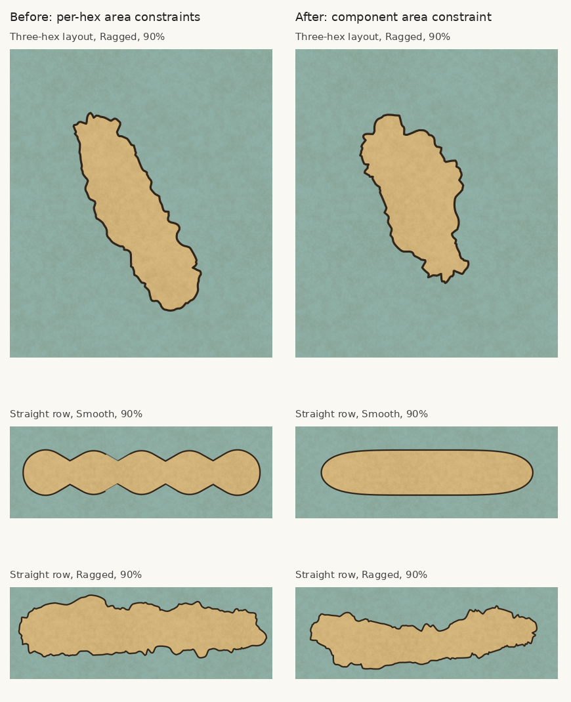
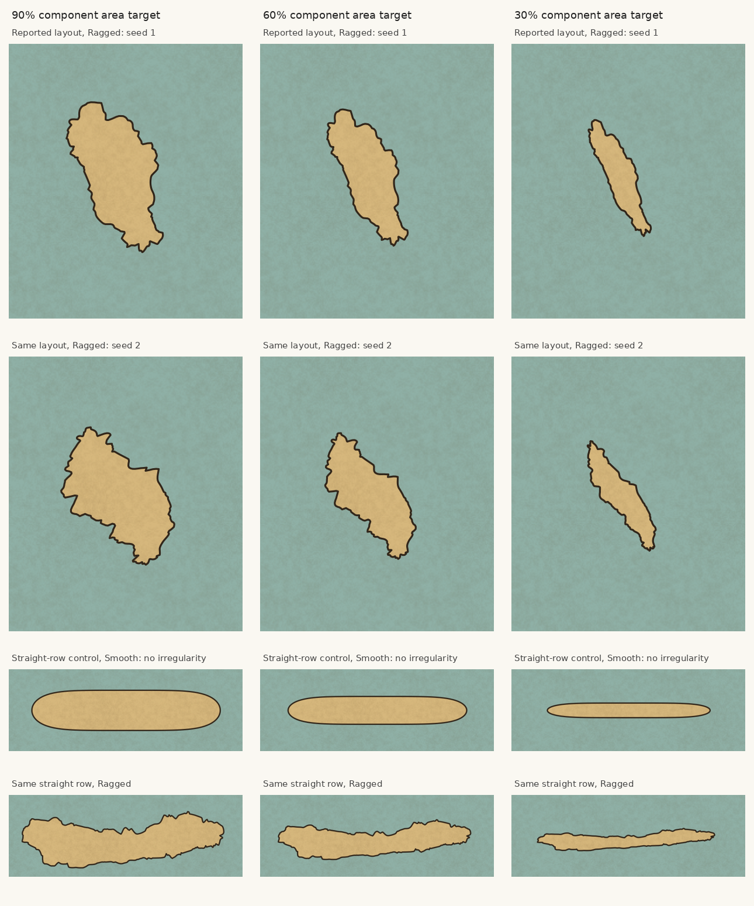

# Coastline widths controlled across a component

The previous versions still started with a coastline cut to each hex's land
share. Repeated narrowing survived because the outline and width constraints
retained those joins. This revision removes that step for ordinary closed
components of Land and Coastal Land with no explicit local land override.

The left column is commit `c2168f6`; the right column is this revision. Inputs,
map seed (`coast-evidence`), 30-pixel hex radius and style are the same. The upper
row recreates the reported three-hex layout at Ragged. The supplied screenshot's
exact map data was not available. The other rows show five hexes in a straight
line, at Smooth and Ragged. Smooth now uses the component stage for eligible
components, with zero irregular detail.

The top two rows use the same three-hex layout with two fixed seeds. The bottom
rows are the straight-row controls. Lowering land area now changes a whole
component instead of cutting its constituent hexes separately. These cases
remain connected at 30%. The Smooth control removes the repeating join waists;
the Ragged renders retain smaller coastal features and broader asymmetry.

## Geometry

Connected components are found in the original land surface before percentage
cuts. An eligible component is traced from that surface and resampled at uniform
arc length. Its silhouette filter spans several hexes. Source-shore clearance
against that same ring no longer constrains its silhouette back toward the hex
waists; nearby independent components still constrain initial movement.

Broad features form the silhouette, then smaller varied coastal features are
added. Detail at tight caps is bounded by the silhouette's curvature radius.
The final component gets one area target: the sum of its cells' requested land
shares. There is no per-hex correction loop on those cells. Area is adjusted
with a positive affine transform along the component's principal axes, with
more adjustment across the short axis on elongated land. This retains contour
topology through the area adjustment. The outer half of the coastline stroke
counts toward the target, using the existing perimeter-times-stroke estimate.

Donor correspondence and border anchors follow the transformed contour. Donor
ground extends beneath it, and original ground fills are clipped to it, so
large movement does not depend on swept correction patches covering every point.

## Scope and constraints

This area policy applies to closed multi-hex Land/Coastal Land components with
one boundary and automatic land shares. Individual hexes may gain or lose land
relative to their individual requested percentage; their component keeps the
combined area target. This redistribution is the change needed to stop treating
each hex join as a shape constraint.

Explicit per-hex land shares or concentration, split geography (including
isthmuses and straits), components containing lakes or holes, and open shores at
the map edge retain their specialized previous handling. The new area adjustment
is not applied to those cases. The existing explicit width tests still pass.

## Verification

Regression coverage checks the absence of join waists on the Smooth straight
row, total component area, simple connected contours across 32 seeds at 90%,
60% and 30%, separation of nearby islands, scene integration before per-hex
cutting, coastline-ink accounting, and the zero-area case. Existing checks cover
zoom, anchors, geographic widths, open endpoints and fill coverage.

All 402 tests, production build, and client/server typechecking passed. Existing
lake and ice comparison tests now hold the map seed fixed across the two cases
so their comparisons isolate irregularity or ground height. These checks establish the tested cases, not topology preservation of arbitrary
inputs before the final affine area adjustment. The images are actual
`buildScene` SVG renders rasterized with Inkscape, not illustrative mockups.

## Reproduction

Use the percentage fixture commands in
[the earlier percentage experiment](coast-land-percent-review.md#land-percentage-and-recurring-coastline-waists),
with the current source. Gallery rows use `percent-90`, `percent-60`, `percent-30`,
the corresponding `-second` tags, and the `-smooth` tags. Their SVGs are saved in
`work/evidence/`.
