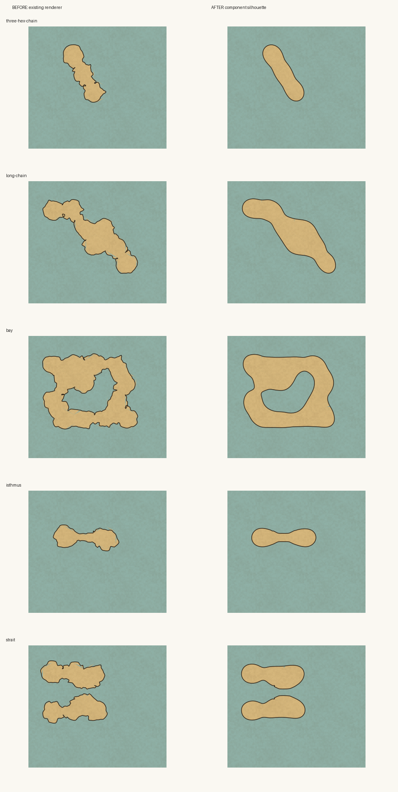

# Component coastline review

The old irregularity stage perturbed a quadratic curve at every original hex
corner. Even with displaced anchors, this retained repeated lobes and notches at
the grid's spacing and directions. On a short chain of land hexes, the silhouette
read as joined rounded hexagons.

Left: the renderer at commit `24c5927`. Right: the component coastline stage.
Both columns use the same input, map seed (`coast-evidence`), 30-pixel hex radius,
Ragged irregularity and parchment style. These are renders from `buildScene` and
`sceneToSvg`, rasterized with Inkscape. The first row recreates the short-chain
failure pattern; it is not an exact replay of the supplied screenshot's map data.

Rows: three-hex chain, longer chain, bay, explicit isthmus, explicit strait.

The new stage traces continuous component boundary rings, including inner rings
and map-edge chains, and samples them at uniform arc-length intervals. A Gaussian
filter spanning multiple hexes forms the silhouette before continuous spatial
noise adds smaller detail. Original edges provide donor colours and border-end
correspondence, rather than mandatory coastline waypoints. Nearby shores and
specified neck/channel widths bound movement. A shorter final filter eases the
bounds without introducing hard joins. Very small components use a shorter
filter so work stays bounded by sample count.

Fill patches retain the exact source boundary and donor changes. Water effects,
water corrections and gained land use the final silhouette as their clip, which
prevents the old boundary from leaving faint marks within the new land shape.
Hex-edge coast mode and fully Smooth coastlines retain their existing geometry.
Lake bodies and separately generated islets keep their existing generation stage.

`node --import tsx scripts/coast-evidence.ts after` writes the five current SVG
fixtures to `work/evidence/`. The saved comparison includes the baseline captured
before the source changes. The input fixtures and rendering options are in that
script.

Regression coverage includes continuous turning on the short chain, repeatable
seeds, zoom scaling, border-anchor attachment, narrow necks/channels, disjoint
components and holes across twelve seeds, and fixed map-edge endpoints. These
checks and the pictured fixtures establish the tested cases; they do not prove
all arbitrary coast inputs preserve topology.

Validation: production build and client/server typechecking passed. All five new
component tests passed. The full suite passed 395 of 396 tests; the remaining
river-turning test was reproduced in baseline `24c5927` with identical geometry
(seed `river-baseline-2`, maximum turn 64.1 degrees versus a 60-degree assertion).
It exercises `riverCourse` directly and does not use coastline geometry.
