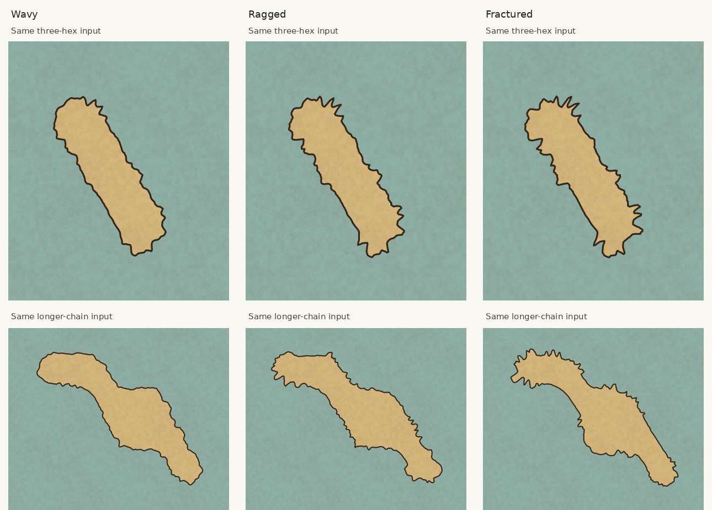
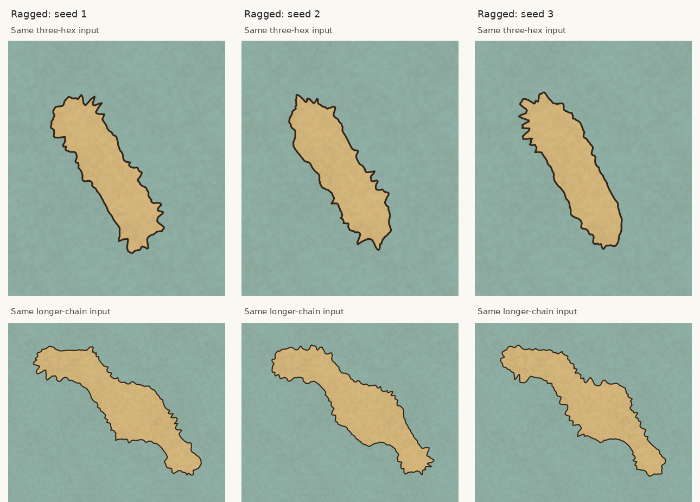

# Irregular coastline review

The original geometry retained one curve per hex corner. Its repeated rounded
lobes, inward notches and grid-aligned shoulders made coastlines look regularly
irregular. Component smoothing alone removed too much detail. Adding coast-arc noise
restored detail but still produced a repeated rounded bump/dip motif. This
candidate replaces that detail generator with warped spatial ridges and erosion
to aim for rugged, angular coastlines. The images are for visual review; passing
geometric checks does not establish that the appearance is satisfactory.


Columns: original renderer at `24c5927`, previous revision at `44a36bc`, current
revision. Rows: three-hex chain, longer chain, bay, explicit isthmus and strait.
Inputs, seed (`coast-evidence`), 30-pixel hex radius, Ragged setting and parchment
style are the same. These are actual `buildScene` / SVG renders rasterized with
Inkscape. The first row recreates the reported pattern; the supplied screenshot's
exact map data was not available.

## Detail and variation



Wavy, Ragged and Fractured on the same inputs and seed. The detail remains in the
rendered silhouette and grows with the chosen level.



Three fixed seeds on the same inputs at Ragged. Detail is sampled from a seeded
two-dimensional gradient field with a random orientation. A broad spatial field warps its coordinates; absolute-value ridges,
one-sided erosion and smaller signed fields add angular points and cuts at
several scales. Regional variation changes strength while retaining fine detail
around the coast. Neither knots along the coastline nor its original hex corners
control feature placement. The field is continuous across closed-ring seams.

## Geometry and fills

Boundary rings are sampled at uniform arc length and filtered across multiple
hexes. Nearby shores and explicit neck/channel widths bound movement. The
component silhouette is eased first; detail is added afterward and is not
smoothed away. Roughness settings and width limits transition as scalar values
without filtering the detailed contour. The two stages share the width budget.

Original edges retain colour donors and border correspondence. Donor ground
extends beneath the final silhouette so folds in correction patches cannot leave
pinholes. Original sea fills, corrections and water effects use the final coast
as their clip. Hex-edge mode, fully Smooth coastlines, lake bodies and separately
generated islets retain their existing stages.

## Reproduction

The fixture script takes a filename tag, map seed and irregularity level:

```sh
node --import tsx scripts/coast-evidence.ts after coast-evidence Ragged
node --import tsx scripts/coast-evidence.ts wavy coast-evidence Wavy
node --import tsx scripts/coast-evidence.ts fractured coast-evidence Fractured
node --import tsx scripts/coast-evidence.ts ragged-second coast-driftwood Ragged
node --import tsx scripts/coast-evidence.ts ragged-third coast-reefs Ragged
```

It writes the current SVG renders into `work/evidence/`. The first two comparison
columns were captured from their respective source versions before this candidate.
Gallery crops are enlarged rasterizations of those SVGs.

Regression coverage includes preserved coarse and fine detail, increasing
irregularity levels, variation that does not align with hex-edge intervals,
deterministic seeds and zoom, border anchors, narrow necks/channels, separate
components and a water hole across twelve seeds, fixed map-edge endpoints, and
painted coverage at former fill pinholes. These checks establish the tested
cases, rather than proving topology preservation for every possible input.

Validation: all 398 tests passed. Production build and client/server typechecking
passed. The new detail-retention regression checks both coarse and fine variation
and Wavy/Ragged/Fractured progression, alongside the geographic width and fill tests.
