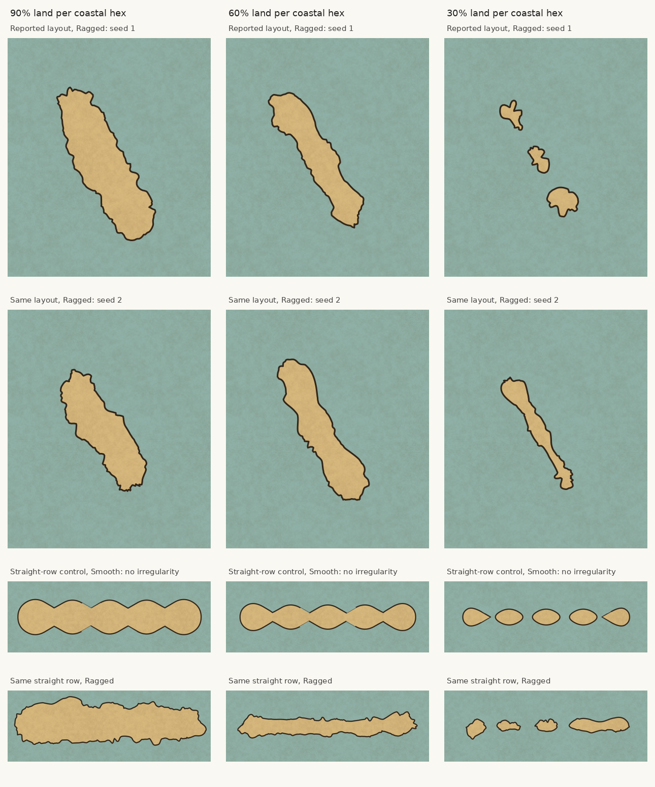

# Land percentage and recurring coastline waists

These are actual renderer outputs from the current PR geometry at 90%, 60% and
30% land per coastal hex. Hex positions, rendering scale and irregularity level
are held fixed within each row. The first two rows use the reported three-hex
layout with two fixed seeds. The supplied screenshot's exact map data was not
available. The last two rows use five hexes in a straight line, with Smooth and
Ragged settings respectively. Smooth is the existing renderer's zero-irregularity
path; it is a control for the underlying outline, not the new component stage.



The repeated narrowing remains visible at 60% in the reported layout. At 30%,
the first seed produces separate islands while the second remains connected.
The straight-row Smooth control has repeated waists at both 90% and 60%, and
separates at 30%. The Ragged straight row is flatter at 60% than at 90%, but that
improvement does not transfer consistently to the other layout.

The high percentage alone does not explain the issue. The starting union of
hexes is wide through hex centres and narrow at their joins. `reshapeCoastHex`
cuts sea-facing sides per hex, retaining their orientations. `cachedCoast` then
adjusts per-hex shares after smoothing, while the component stage bounds movement
against that source outline and source-shore clearance. Those constraints still
carry grid structure into the resulting silhouette. Lowering the percentage
changes widths and can break connections; it does not reliably remove that
structure. The PR's coastline appearance remains unresolved.

To reproduce each column, pass the coastal percentage as the fifth argument:

```sh
node --import tsx scripts/coast-evidence.ts percent-90 coast-evidence Ragged 90
node --import tsx scripts/coast-evidence.ts percent-60 coast-evidence Ragged 60
node --import tsx scripts/coast-evidence.ts percent-30 coast-evidence Ragged 30
node --import tsx scripts/coast-evidence.ts percent-90-second coast-driftwood Ragged 90
node --import tsx scripts/coast-evidence.ts percent-60-second coast-driftwood Ragged 60
node --import tsx scripts/coast-evidence.ts percent-30-second coast-driftwood Ragged 30
node --import tsx scripts/coast-evidence.ts percent-90-smooth coast-evidence Smooth 90
node --import tsx scripts/coast-evidence.ts percent-60-smooth coast-evidence Smooth 60
node --import tsx scripts/coast-evidence.ts percent-30-smooth coast-evidence Smooth 30
```

The saved SVGs are in `work/evidence/`. All three settings and both seeds were
rendered rather than selecting only cases that improve. The gallery includes
same-scale crops; the straight row has a smaller enlargement than the upper rows.
