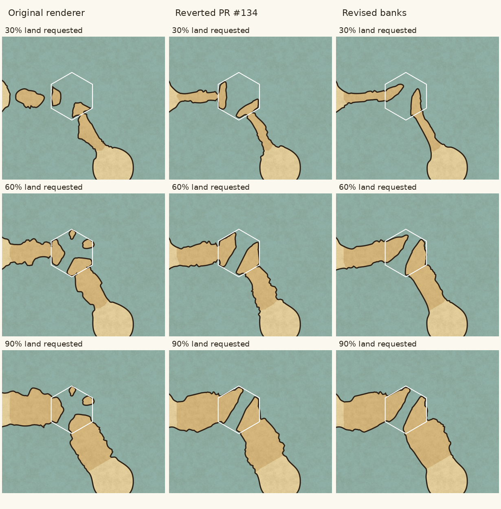

# Strait geometry and rendered land coverage

The revised strait banks extend and taper into the hex, instead of spreading
sideways as long bars along its boundaries. Their adjoining coastal hexes use
broad joins shaped from the coastal core, instead of tiny artificial bridges.
Attachment and percentage accuracy alone were insufficient: the reverted PR
kept the specific shape that the user had rejected.

The three columns are actual scene/SVG renders from the original renderer
(`7fd124e`), reverted PR #134 (`4265590`), and this revision rebased onto main
(`724e200`).
Inputs are held fixed: seed `investigation`, 30-pixel hex radius, Ragged
irregularity, Normal strait width, two non-opposite mainland neighbours. The
strait and its two coastal neighbours request 30%, 60% or 90% land in each row.
The white border identifies the strait. This is a controlled reproduction of
the reported arrangement, rather than the original screenshot's unavailable
saved map.

## Why PR #134 was still wrong

That PR replaced the many-arm subtraction and improved attachment and area
fitting, but grew each bank by intersecting its territory with a slab parallel
to its mainland-facing edge. Reducing the share reduced the slab's depth while
retaining its long breadth along the edge. This directly produced the rejected
sideways lobes. Different depths could not remove that construction's bias.

The adjoining coastal hex was joined to the strait through an arm only 4% of a
hex radius wide on either side. It could therefore have a tiny neck followed by
a much broader bank. Independent local area fitting did not know that this
shape was undesirable. Tests checked attachment, area and crossings, but had
no criterion for a shallow edge bar or a head widening beyond a narrow join.

The new shape regression was run against PR #134 and fails there. It passes
against this revision. A second regression measures the final rendered join
and foreland across three fixed seeds, rather than checking only polygons.

## What failed before PR #134

- `fixedLand` subtracted water arms to *every* sea-facing edge from growing
  sectors/bands. At Normal width, the non-opposite-bank reproduction drew
  42.72% land for requests of 50%, 60% and 90%, including two detached islands
  **before smoothing**. The code's attachment guarantee was therefore false.
- The width revision (`e6ec53b`) introduced that construction. The selectable
  junction revision (`9a202e1`) moved its common junction without replacing the
  bank/subtraction mechanism. Shared parameters retained paired edge-hugging
  shores; outline noise did not remove the underlying arrangement.
- Whole-component area fitting (`050892a`) excludes split geography, explicit
  local shares and components touching split geography. Its improvements did
  not reach these straits or their neighbouring coastal components.
- The local area correction used requested intermediate area plus correction
  patches and perimeter-times-ink. A clamped shape did not necessarily have
  that intermediate area, and overlapping patches/strokes were miscounted.
  Explicitly fitted straits were excluded from convergence error. Seven passes
  could oscillate and return an inaccurate estimate without reporting it.
- Feature randomness depended on the moving contour centroid. Fitting changed
  the seed input, reshaping bays/capes between passes. Coarse component identities
  now keep features stable during fitting, including temporary source fragments.
- Repeated rounding of polygon intersections and coarse coastline keys could
  leave dangling shore ends. Very small fragments also failed a one-direction
  collinearity check. Intersections now retain precision; matching endpoints
  are canonicalised before tracing, and anchors use the same finer keys.
- Independent coastal inset cuts could detach a strait's donor mainland at low
  coverage. Coastal hexes adjoining straits now retain their land-facing joins
  while their complete connected outline is fitted.

The old “stays joined” test checked contact at mainland-facing edge midpoints,
not attachment of every land component. Its area test checked only targets
inside the old construction's feasible range. Both could pass with these bugs.

## Revised bank construction

Each bank is a convex cap rooted at a mainland-facing edge, tapering into its
connected territory. Inland depth and tangential breadth grow together; a low
share cannot retain a fixed full-edge breadth as its depth vanishes. The
territory determines its inland direction, while the map seed varies the
banks' depths independently.

The root breadth is bounded using the neighbouring coastal outline at its
requested share. That requested share stays stable while ink/noise fitting
adjusts the temporary construction. Using the moving temporary share for this
bound made the passage fitter's attainable range fluctuate and caused some
seeds to miss a feasible percentage. Moderate broadening remains possible;
the final rendered regression bounds the foreland-to-join width ratio below
1.5 in the reported low-share layout.

Coastal joins are formed from the convex hull of the inset core and broad
segments at its mainland-facing boundaries. This replaces the narrow bridge.
Only overlapping caps at consecutive dry sides are combined, avoiding an
artificial minimum area when separated small caps remain feasible.

A closed water-facing loop contained entirely inside a strait is an incidental
inland pocket. It is filled from the traced boundary, with corresponding
updates to the land polygons, donor patches and water clip. Positive land
components are still required to attach to a mainland. Zero-area clipping
fragments are discarded and disjoint clip boxes skipped; this also avoids
pathological fragmentation when filling small pockets.

With no explicit land-share request, the banks reach the channel's natural
width envelope. Explicit lower shares can pull the banks back and widen the
water. The existing width, selected-junction and monotonic-area tests pass.

## Final coverage and topology

The fitter measures the final filled outline and the union of its round
coastline stroke inside each exact hex. It counts holes with even-odd fill and
counts overlapping ink once. Explicit passage targets participate in fitting;
their attainable range is measured with neighbours held fixed.

Residual local shares are fitted on the final silhouette while keeping hex
crossings fixed. Small positive local scales preserve detailed capes; passage
adjustments preserve the central junction and are bounded by shore clearance
and width. Candidate fold-backs/crossings are rejected. Existing small loops
at roughened caps are removed before the final fit. Ground, water and coast
corrections share the final land/water clips, and border anchors follow the
adjusted shore.

A requested share above the chosen width's attainable maximum is reported in
the inspector's existing drawing-compromise notes, with the achieved coverage
and advice to change the width or percentage. It is not silently treated as a
successful fit. Lower shares can widen a passage, retaining the existing rule
that reduced land takes priority over its natural width.

Raster measurements include coastline ink, with texture/grid/water effects
switched off for measurement. Geometry, seed and normal coastline width remain
unchanged. The inspected colour gallery above retains the parchment effects.

| Requested land | Strait (Ragged) | Left coastal hex | Lower-right coastal hex |
| --- | ---: | ---: | ---: |
| 30% | 30.18% | 29.84% | 30.11% |
| 60% | 60.37% | 60.11% | 59.72% |
| 90% | 69.59%; width limit reported | 89.94% | 89.91% |

## Regression coverage

`test/straitRendering.test.ts` covers the reported two-island case, all 62 mixed
land/sea neighbour masks at four widths and three shares (744 cases), all six
selected junctions at four widths and three shares (72 cases), independent bank
profiles, final rendered shares over three fixed seeds, simple/disjoint shores,
water at the junction, unattainable-share reporting, holes and overlapping ink.
Final achievable shares must be within one percentage point, with exactly two
mainland contours in the reported layout. The new low-share shape check covers
six rotations at 10% and 30% land: each bank's inland depth must exceed 65% of
its tangential span. The rendered neck/lobe check covers the same three seeds
at 30% and rejects forelands more than 1.5 times their adjoining mainland width.
These are concrete regression checks for the reported defects, not a proof
that every generated coastline will look natural.

Two pre-existing river tests used random map IDs as geometry seeds and failed
intermittently in unrelated curvature/lake-shore assertions during verification.
They now use fixed named seeds; their assertions are unchanged.

The sandbox blocks the `tsx` CLI's IPC socket. The full suite is run through
`node --import tsx` directly, once per test file, avoiding that socket while
running every test. Build and client/server typechecking use the usual scripts.

Validation: all 419 tests passed on the revision rebased onto main at
`724e200`; production build and client/server typechecking passed. The
same-scale raster measurements above and the three-version gallery were
regenerated from the validated geometry. Existing build warnings concern
bundle size and font imports.
